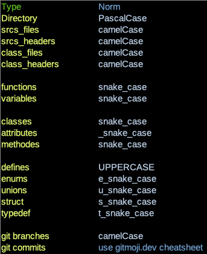

# webserv
A 42 project about HTTP  

> :warning: **Warning**: It is educational project.  

> :warning: **Warning**: You can take inspiration from it but don't copy / paste what you don't understand.  

## Install  
You only need to run **make**.  
All libraries will be build and the binary will be ready to launch  

## Content
* A simple read/write communication HTTP server.  
 
## Ressources  
* https://www.ibm.com/docs/en/i/7.2?topic=designs-using-poll-instead-select     <-Different API explanation  
* https://www.restapitutorial.com/httpstatuscodes.html  <-HTTP Return status  
* https://medium.com/from-the-scratch/http-server-what-do-you-need-to-know-to-build-a-simple-http-server-from-scratch-d1ef8945e4fa      <-HTTP Server tuto  
 
 CGI:
* http://www.whizkidtech.redprince.net/cgi-bin/tutorial  <- CGI basics
* https://jkorpela.fi/forms/cgic.html  <- CGI programming tutorial
* https://www.garshol.priv.no/download/text/http-tut.html <- HTTP and CGI explained
 
## The Norm

### :zzz: TODO :zzz:  
*  Comment each methods  
*  Implement the poll/select  
*  Add a log file with timestamp.  
### :boom: Known bugs.. I mean features :boom:  
* Getting "Relais brisé (pipe)" error sometimes when trying to read clients' requests.  

## :writing_hand: Change log :writing_hand:  
* The client_request class is now filled up "correctly".  
* The branch gettingRequest hab been merged up.  

### Git status return :

        nouveau fichier : Includes/Classes/client_request.hpp
        modifié :         Includes/Classes/server.hpp
        renommé :         Includes/Classes/request.hpp -> Includes/webserv.hpp
        modifié :         Makefile
        modifié :         README.md
        nouveau fichier : Srcs/Classes/ClientRequest/client_request.cpp
        renommé :         Srcs/Classes/server.cpp -> Srcs/Classes/Server/server.cpp
        modifié :         Srcs/main.cpp
